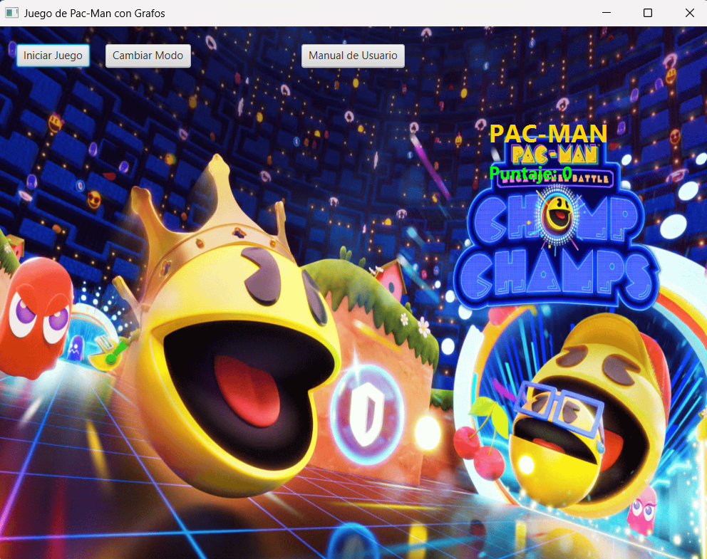
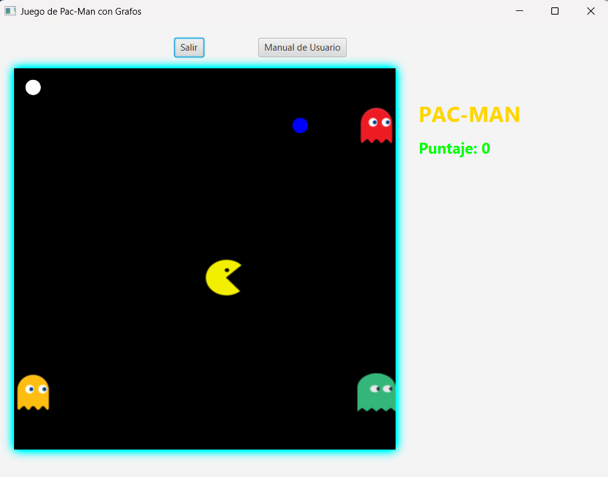
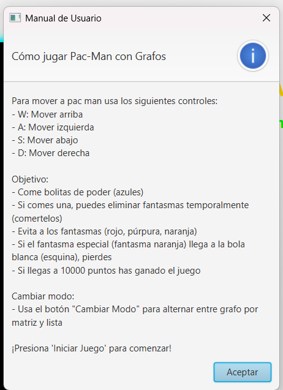

# Pac-Man Graph Game

A simple Pac-Man-inspired game developed in **Java and JavaFX** to demonstrate the use of **graphs, graph representations, data structures, and traversal algorithms** in an interactive environment.

The game board is modeled as a graph, where the cells represent vertices and the connections between them represent edges. Different graph algorithms are used to define the behavior and movement of the ghosts.



## Gameplay

The player controls Pac-Man using the **W, A, S and D** keys while interacting with a 10x10 board.

The objective is to collect power-ups, avoid the ghosts when vulnerable, and reach **10,000 points**. While a power-up is active, Pac-Man can eat ghosts and earn additional points.



## Graph-Based Ghost Behavior

Each ghost demonstrates a different graph traversal or shortest-path algorithm:

| Ghost | Algorithm | Behavior |
| --- | --- | --- |
| Green | BFS | Searches for Pac-Man using breadth-first traversal |
| Red | DFS | Moves through the graph using depth-first traversal |
| Orange | Dijkstra | Searches for the shortest path toward the target |

This makes the game a simple visual demonstration of how different graph algorithms behave when applied to the same environment.

## Graphs and Data Structures

The project implements two different graph representations:

- **Adjacency Matrix**
- **Adjacency List**

The player can switch between both representations while playing.

Several data structures were also implemented as part of the project, including:

- Queue
- Stack
- Priority Queue
- Weighted edges

In addition to the algorithms used directly by the ghosts, the project contains implementations of:

- BFS
- DFS
- Dijkstra
- Floyd-Warshall
- Prim
- Kruskal

## Technologies

- Java 21
- JavaFX 21
- FXML
- Maven
- JUnit 5

The application uses JavaFX for the graphical interface and Maven for dependency and project management.

## Testing

The project includes unit tests for the graph representations, custom data structures, and graph algorithms.

The current test suite contains **43 tests**.

Run the tests with:

```bash
./mvnw test
```

On Windows:

```powershell
.mvnw.cmd test
```

## Running the Game

Make sure Java is installed and run:

```bash
./mvnw javafx:run
```

On Windows:

```powershell
.mvnw.cmd javafx:run
```

## User Manual

The game includes a simple user guide explaining the controls and basic gameplay.



## Academic Context

This project was developed as an academic exercise to explore the practical implementation of **graphs, graph traversal algorithms, shortest-path algorithms, minimum spanning trees, and custom data structures**.

Rather than focusing on creating a complex video game, the project uses a simple Pac-Man environment to visually demonstrate how these concepts can be applied to movement and pathfinding problems.

## Author

**Jose David Libreros Alvarez**
